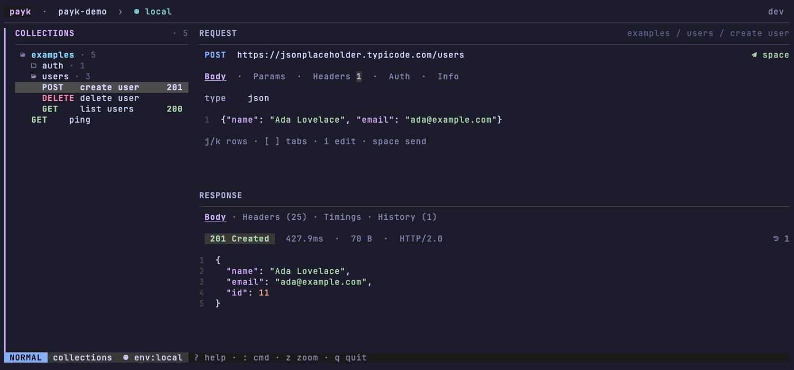
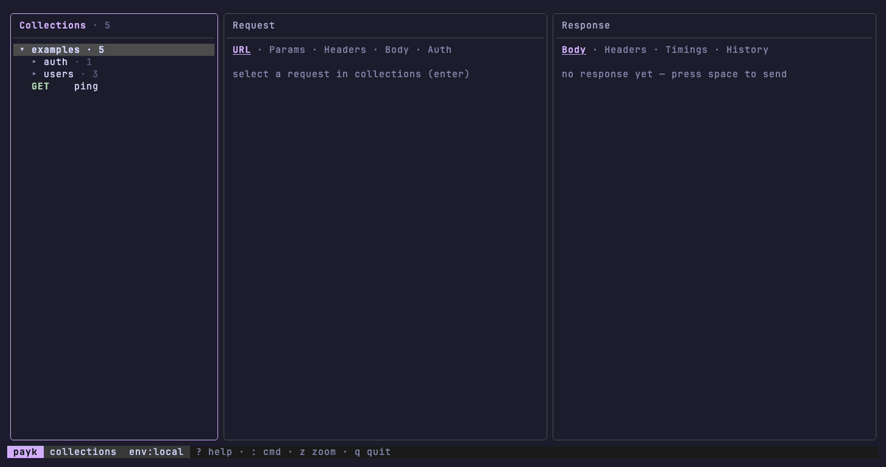

# payk

A fast, keyboard-first TUI HTTP client: it carries your requests and brings
back responses — with timings, pretty JSON, and zero mouse involved. Think
Yaak or the PyCharm HTTP client, living in your terminal. One static
binary, no runtime dependencies.



## Features

- **Frameless vim-style UI** — collections tree on the left, request above
  response (or three columns, your choice). `j/k/gg/G` everywhere, `/` to
  search in any pane, `:` command line with completion, `?` adaptive help.
  A mode badge tracks NORMAL/INSERT/SEARCH/COMMAND, panes resize with
  `<`/`>`, and `z` zooms one to fullscreen.
- **Configurable** — theme (Catppuccin flavors plus a transparent espresso),
  icon set (Nerd Font, unicode, or none), layout, frame style, line numbers,
  and sidebar width live in `config.yaml`, changeable on the fly with
  `:theme`, `:layout`, `:icons`, `:chrome`.
- **Plain YAML storage** — one file per request, folders are directories,
  stable key order. Everything lives in `.payk/` next to your code and
  diffs cleanly in git.
- **Environments** — `{{var}}` substitution from named environments,
  `{{env:NAME}}` from process env. Secrets are resolved in memory at send
  time and never written to disk. Typing `{{` autocompletes variable names.
- **Importers** — paste a curl command (Chrome DevTools export works
  as-is), point at an OpenAPI 3.0/3.1 spec (file, URL, or pasted JSON), or
  at a FastAPI project directory. Trees group by tags, bodies get examples
  generated from schemas, server URLs become environments, and declared
  auth (bearer/basic/apiKey) is pre-filled.
- **Response viewer** — highlighted pretty-printed JSON with line numbers
  and a raw-bytes toggle, aligned headers table, a timeline waterfall of the
  network trace, incremental search with `n/N`, soft wrap, one-key
  copy to clipboard, and a per-session history of past responses. The tree
  remembers each request's last status code.
- **Request editor** — tabbed (URL/Params/Headers/Body/Auth) with
  insert/normal modes, chained header entry, JSON body formatting and
  highlighting, and an `$EDITOR` escape hatch for the body.

See **[docs/usage.md](docs/usage.md)** for the full guide.

## Demo



## Install

Homebrew (macOS):

```sh
brew install yusupkhemraev/tap/payk
```

On first install Homebrew asks to trust the tap once — that is its
standard [tap trust](https://docs.brew.sh/Tap-Trust) prompt for any
third-party tap.

Go:

```sh
go install github.com/yusupkhemraev/payk/cmd/payk@latest
```

Or grab a release binary from the
[releases page](https://github.com/yusupkhemraev/payk/releases)
(darwin/linux/windows, amd64/arm64), or build from source
(`go build ./cmd/payk`).

## Quick start

```sh
cd your-project
payk                       # discovers ./.payk or ~/.config/payk
```

No workspace yet? Import something — payk creates `./.payk` on the fly:

- paste a curl command straight into the terminal and confirm with `y`;
- `:import https://api.example.com/openapi.json`
- `:import ~/dev/my-fastapi-project`

Requests are plain YAML, one file each:

```yaml
# .payk/collections/api/create-user.yaml
name: create user
description: Registers a new account
method: POST
url: "{{base_url}}/users"
headers:
  - name: Content-Type
    value: application/json
body:
  type: json
  content: |
    {"name": "Ada"}
auth:
  type: bearer
  token: "{{env:API_TOKEN}}"
```

## Keybindings

| Key | Action |
| --- | --- |
| `h` / `l`, `tab` / `shift+tab` | switch pane focus |
| `j` / `k`, `gg` / `G`, `ctrl+d` / `ctrl+u` | move / scroll |
| `enter` | open request · toggle folder · cycle enum field · pick history entry |
| `i` | edit field (insert mode), `esc` back to normal |
| `a` | add param/header row · new request in tree |
| `d` | delete row in editor · delete tree node (with confirm) |
| `r` | rename in tree · raw/pretty body in response |
| `f` | format JSON body |
| `e` | edit body in `$EDITOR` |
| `space` | send request (`esc` cancels) |
| `[` / `]` | previous / next tab (editor and response) |
| `/`, `n` / `N` | fuzzy search in pane, next/previous match |
| `g` | jump labels in the tree (`gg` still goes to top) |
| `w` | wrap long lines |
| `y` | copy response body |
| `m` | message log (full text of truncated status messages) |
| `z` | fullscreen the focused pane |
| `<` / `>` | narrow / widen the focused pane |
| `ctrl+b` | toggle collections sidebar |
| `:` | command line — `:q` `:w` `:send` `:env` `:set` `:import` `:reimport` `:theme` `:layout` `:icons` `:messages` |
| `?` | help overlay |

## Layout

By default the tree sits on the left and the request stacks above the
response, so both bodies get the full width. `layout: columns` puts all
three side by side instead. Below 80 columns payk falls back to a single
pane with tab switching; everything stays usable at 60×20.

## Development

```sh
go build ./...      # build
go test ./...       # unit + TUI smoke tests (teatest)
vhs docs/demo.tape  # re-render the demo GIF
```

The domain (`internal/core`), storage, HTTP client, and importers are
plain Go packages with no TUI imports — testable headlessly. Panels are
independent Bubble Tea models; the root model only routes messages.
